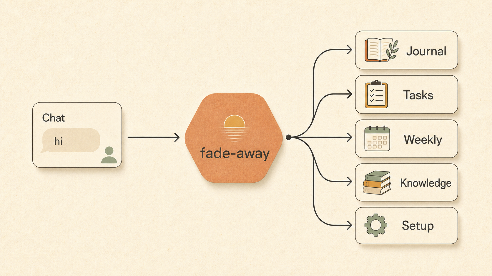
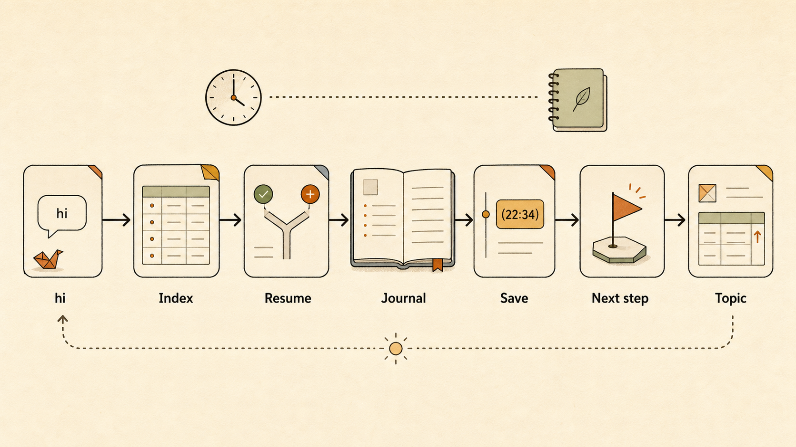
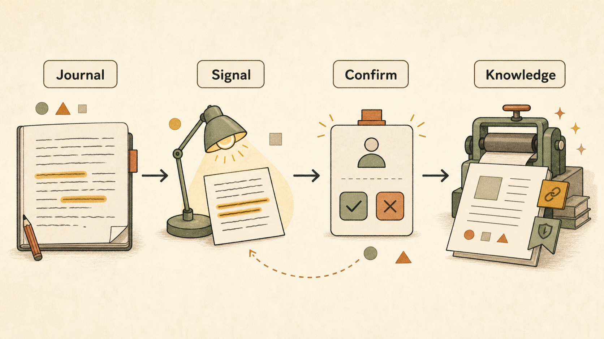
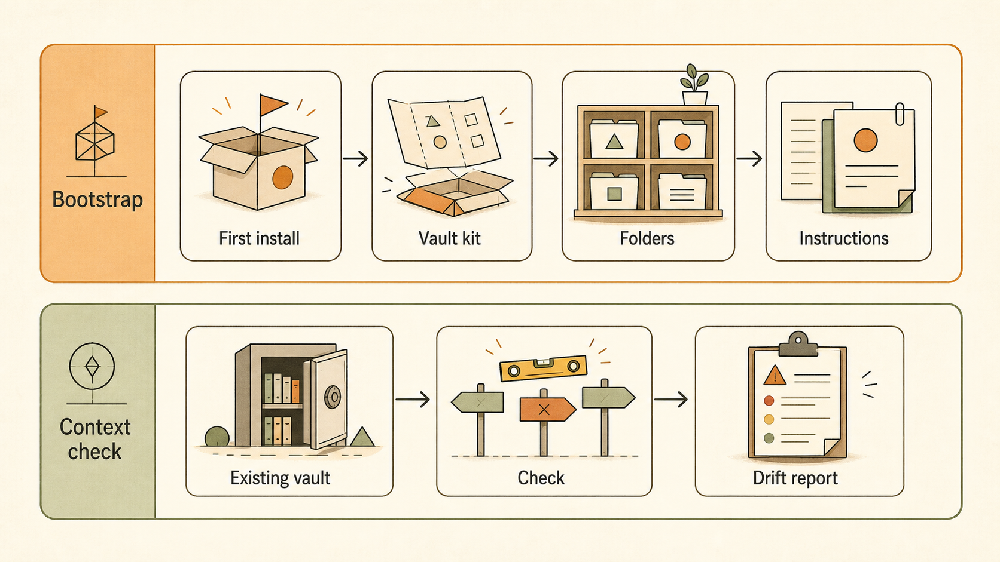
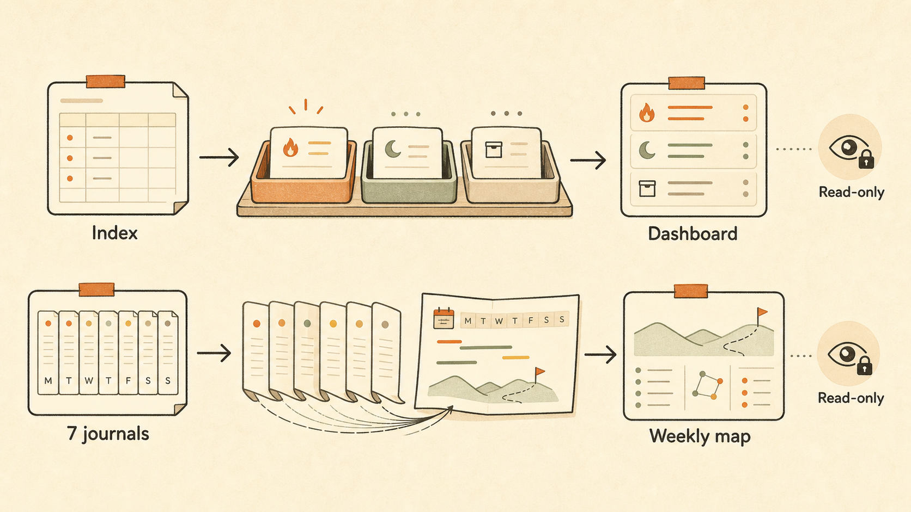

<div align="center">

# Fade-away

**A durable memory layer for AI chat — so the next session resumes instead of restarting.**

[](./LICENSE)

-olive)

</div>



---

## What is Fade-away?

Chat agents are stateless. Every new session starts from zero, and you re-explain
the project — again. **Fade-away** is a session-tracker *skill* (for Claude Code
and Codex) that leaves a small, written trail inside an ordinary
[Obsidian](https://obsidian.md) vault. Work survives across sessions, tasks stay
switchable, and a private, reusable knowledge base grows over time — all in plain
Markdown you own, never a black box.

It maintains five durable surfaces, each more curated than the last:

`Journal → Topic page → Task index → Weekly MOC → Knowledge wiki`

Everything is written **only with your confirmation**. The skill suggests; you decide.

---

## How it works

### 1 · The memory layer

Five plain-Markdown surfaces, increasing in permanence from left to right. The
conversation feeds the journal; the journal rolls up into tasks, weeks, and —
through a human gate — curated knowledge.


### 2 · Daily session loop

How a single chat resumes yesterday's work and saves tomorrow's starting point:
read the task index → restore the topic → open today's journal → save one progress
line per useful turn → bind the next step back into the index.



### 3 · Knowledge promotion (human-gated)

Useful lessons stay buried in logs, but auto-writing a wiki creates noise.
Fade-away spots reusable patterns, proposes a candidate, and writes a curated
knowledge page **only after you approve it**.



### 4 · Bootstrap vs. context check

Two distinct cold-start paths. **Bootstrap** creates a minimal vault the first
time. **Context check** audits an existing vault for instruction drift — read-only,
reporting before it changes anything.



### 5 · Read-only views

Three on-demand views — **Dashboard**, **Weekly MOC**, **Memory Lint** — that only
read and render. They never open a journal entry or write a file unless you confirm a fix.



---

## Features

- **Per-turn save** — every substantive turn appends one timestamped progress line; nothing useful is lost between turns.
- **Resume, don't restart** — a fresh chat reads the task index and continues from the last real next step.
- **Task switching** — bound topic pages remember scope, status, decisions, and the next action per project.
- **Weekly roll-ups** — on-demand map-of-content for any ISO week.
- **Human-gated knowledge base** — tested lessons become reusable rules only with your approval.
- **Read-only audits** — dashboard, weekly index, and memory-health lint that never mutate files.
- **Plain Markdown + Obsidian** — your data, your vault, fully portable. No database, no lock-in.
- **Configurable** — vault root and time zone are read from your `AGENTS.md` / `CLAUDE.md`.

---

## Install

### Step 1 — Add the skill

Pick whichever is easiest. All three drop the `fade-away/` skill folder into your
agent's skills directory.

#### Option A · Just ask your agent (no terminal)

Paste this to Claude Code or Codex:

> Install the Fade-away skill from `https://github.com/Aresfangxx/fade-away-skill`
> into my skills directory, then set it up for my vault.

The agent clones the repo, copies `fade-away/` into `~/.claude/skills/`
(or `~/.agents/skills/` for Codex), and runs setup for you.

#### Option B · One-line install (curl)

```bash
# Claude Code (default → ~/.claude/skills/fade-away)
curl -fsSL https://raw.githubusercontent.com/Aresfangxx/fade-away-skill/main/install.sh | sh

# Codex (override the target directory)
curl -fsSL https://raw.githubusercontent.com/Aresfangxx/fade-away-skill/main/install.sh \
  | FADE_AWAY_SKILL_DIR="$HOME/.agents/skills/fade-away" sh
```

#### Option C · Clone and copy

```bash
git clone https://github.com/Aresfangxx/fade-away-skill.git
cp -R fade-away-skill/fade-away ~/.claude/skills/fade-away   # or ~/.agents/skills/fade-away
```

### Step 2 — Initialize your vault (just talk to the agent)

You do **not** run any script yourself. Once the skill is installed, open your
agent and say:

> setup fade-away

(`初始化`, `bootstrap`, or `install` work too.) The skill's bootstrap module then:

1. asks for your vault location and time zone (or reads `FADE_AWAY_VAULT_ROOT`),
2. shows you exactly what it will create and waits for your confirmation,
3. creates only the missing folder skeleton — **never overwriting existing files** —
   and records the `Vault root` + `Time zone` into your `AGENTS.md` / `CLAUDE.md`.

That's it. From then on, greet the agent with `hi` and it offers to resume your
last task.

<details>
<summary>Advanced: run the installer manually</summary>

If you prefer to bootstrap without the agent, the script is idempotent and
creates only missing files:

```bash
python3 ~/.claude/skills/fade-away/scripts/bootstrap_vault.py \
  --vault-root "/absolute/path/to/your/Obsidian/Vault" \
  --timezone "Asia/Hong_Kong"   # change to your zone, e.g. America/New_York

# Flags: --dry-run, --agent-surface {agents,claude,both,none}
```

</details>

---

## Vault structure

```text
<your vault>/
├── 00 Tasks/
│   ├── _Index.md          # task index: one row per active topic + next step
│   └── <topic>.md         # per-task wiki page
├── 02 Knowledge/
│   └── <domain>/<page>.md # curated, cross-project rules (human-gated)
├── 03 Journal/
│   └── <YYYY-MM>/<YYYY-Wnn>/
│       ├── YYYY-MM-DD.md          # daily timeline of timestamped progress
│       └── YYYY-Wnn 周索引.md      # weekly map-of-content (on demand)
└── 04 Templates/
    └── Daily Note.md
```

## Configuration

Fade-away reads two settings from your vault's `AGENTS.md` / `CLAUDE.md`:

| Setting | Meaning | Default |
| --- | --- | --- |
| `Vault root` | Absolute path of the vault to maintain. If unset, the current project directory is used. | current project dir |
| `Time zone` | The single zone ("vault-time") used for all filenames, ISO weeks, and timestamps. | `Asia/Hong_Kong` |

## Safety & design principles

- **Suggest first, write after confirmation** — knowledge and topic promotion always ask before writing.
- **Read-only views stay read-only** — dashboard, weekly index, and lint render reports; they do not mutate files.
- **Never delete, move, or overwrite** existing vault files unless you explicitly ask.
- **Bootstrap only creates what's missing** — existing files are skipped, never clobbered.

## Repository layout

```text
.
├── README.md
├── LICENSE
├── docs/images/            # the architecture diagrams above
└── fade-away/              # the installable skill
    ├── SKILL.md            # the hot-path operating contract
    ├── references/         # low-frequency workflow modules, loaded on demand
    ├── agents/openai.yaml  # Codex / OpenAI agent manifest
    └── scripts/bootstrap_vault.py
```

## License

[MIT](./LICENSE)
